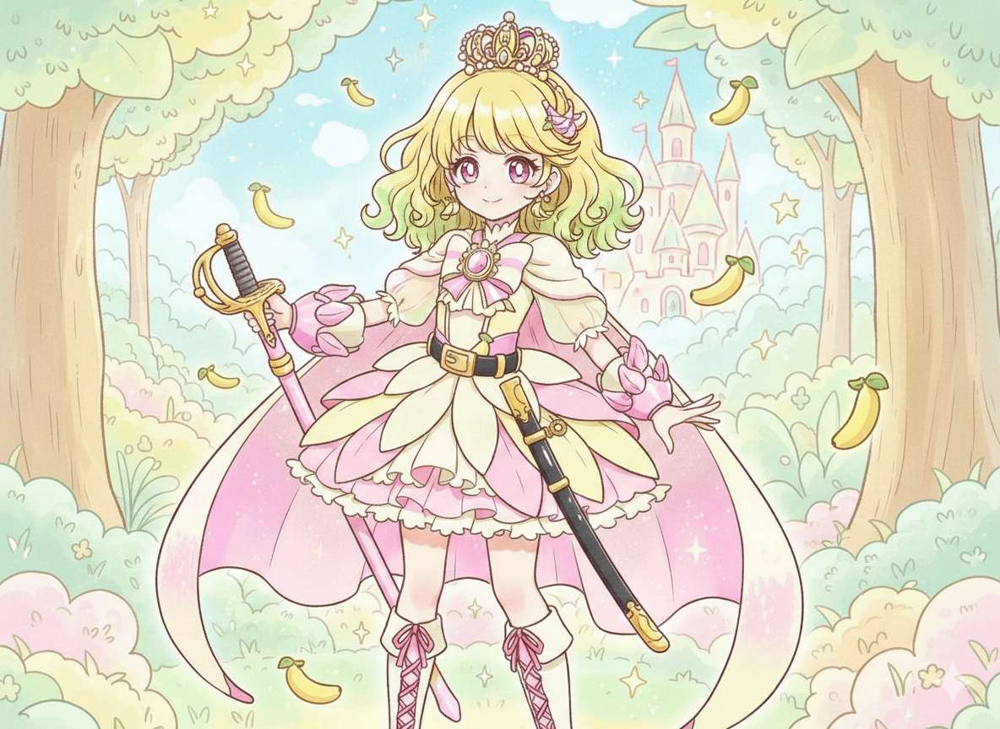
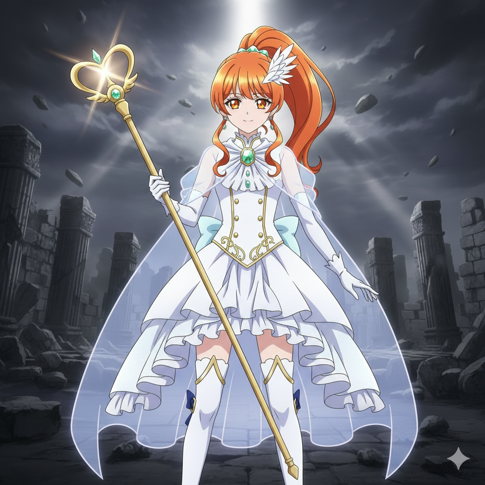
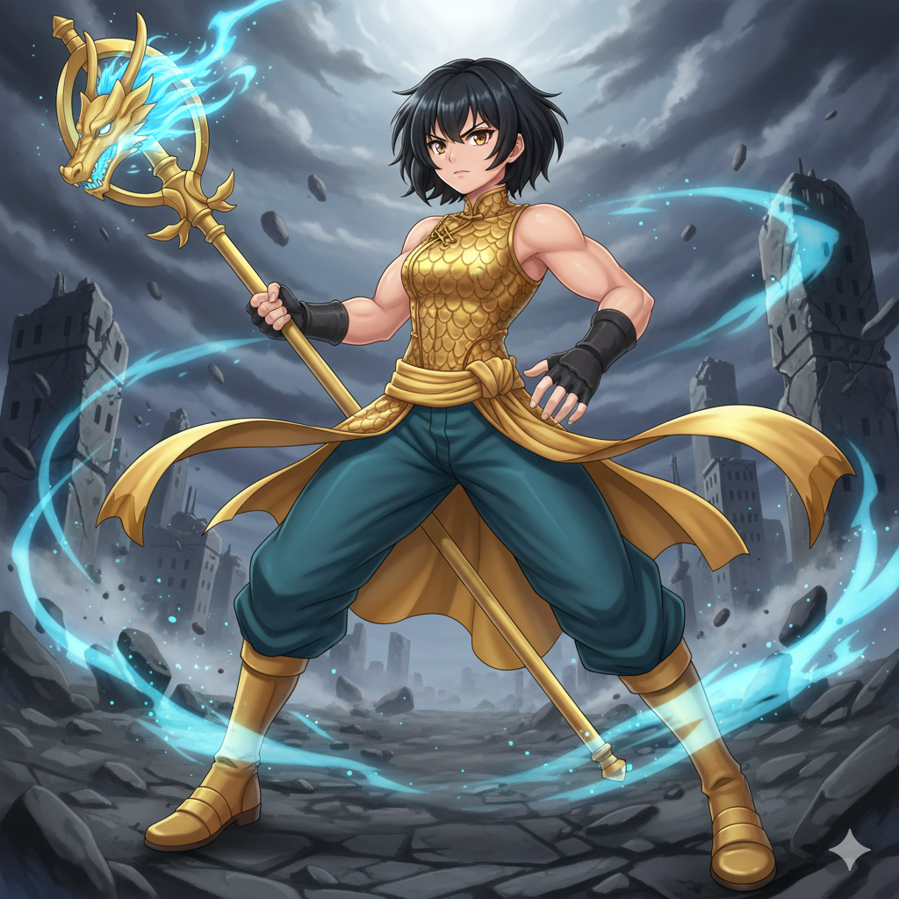
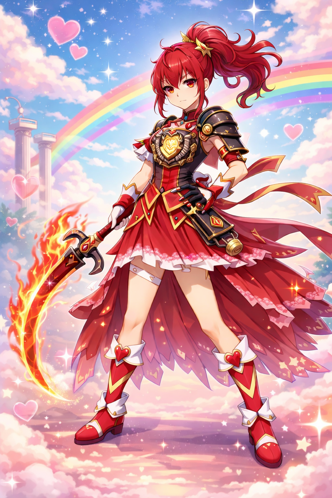
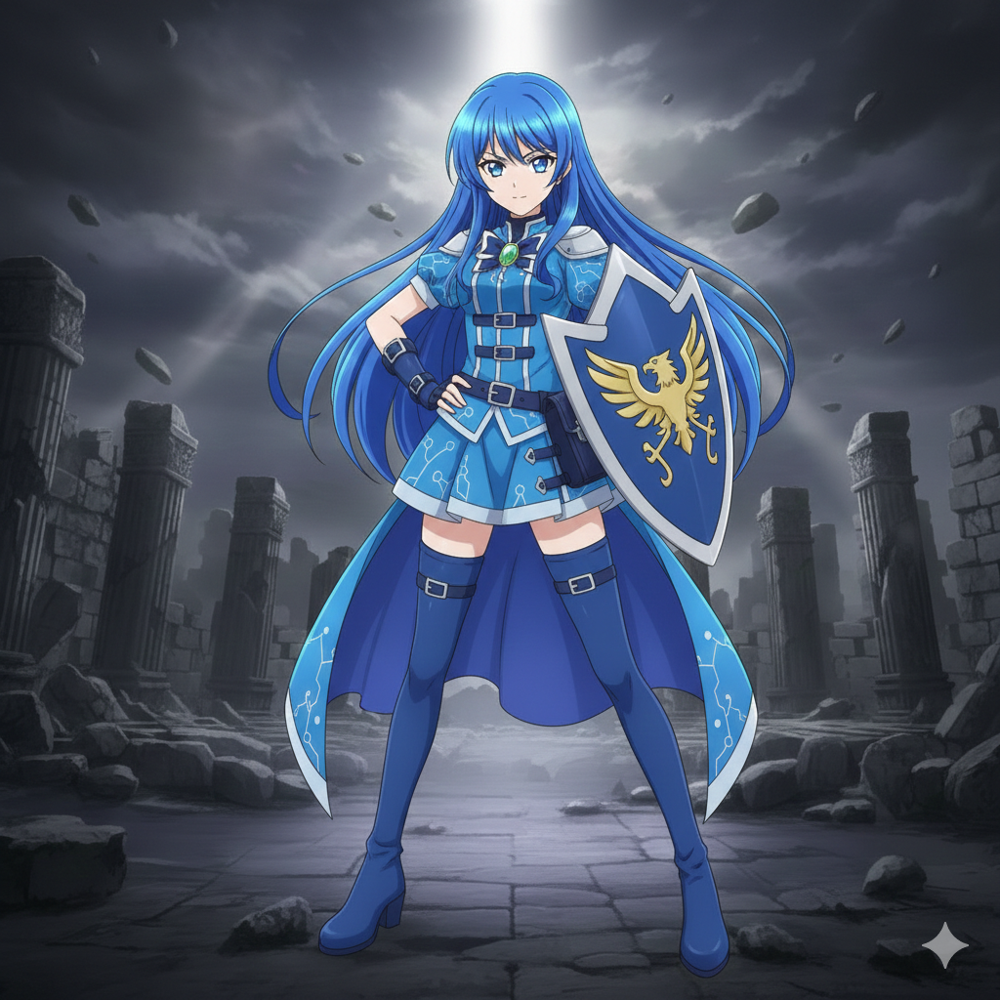

# 企画書：アライズ（Allies）プリキュア

※完全なおふざけ企画・非公開前提

作成日:2026/2/9

## 目次

- [企画書：アライズ（Allies）プリキュア](#企画書アライズalliesプリキュア)
  - [目次](#目次)
- [企画コンセプト](#企画コンセプト)
  - [テーマ](#テーマ)
- [世界観](#世界観)
  - [人間界](#人間界)
  - [妖精界](#妖精界)
- [変身システム](#変身システム)
  - [変身アイテム](#変身アイテム)
  - [アライアンスフォンの機能](#アライアンスフォンの機能)
  - [AI妖精ナビ（設定）](#ai妖精ナビ設定)
- [メインキャラクター](#メインキャラクター)
  - [キュアクラウン（アローズ・ヨーカスター）](#キュアクラウンアローズ・ヨーカスター)
    - [変身のセリフ](#変身のセリフ)
    - [必殺技](#必殺技)
  - [キュアルミエール（天羽 白葉）](#キュアルミエール天羽-白葉)
    - [変身のセリフ](#変身のセリフ-1)
    - [必殺技](#必殺技-1)
  - [キュアドラゴン（ユン）](#キュアドラゴンユン)
    - [変身のセリフ](#変身のセリフ-2)
    - [必殺技](#必殺技-2)
  - [キュアレーテ（イリーナ・レーテ）](#キュアレーテイリーナレーテ)
    - [変身システム（特殊）](#変身システム特殊)
    - [変身のセリフ](#変身のセリフ-3)
  - [キュアリバティ（蒼井 律）](#キュアリバティ蒼井-律)
    - [変身のセリフ](#変身のセリフ-4)
- [プリキュア必殺技](#プリキュア必殺技)
- [敵キャラクター](#敵キャラクター)
  - [プロパガンダ（最終ボス・Propaganda）](#プロパガンダ最終ボスpropaganda)
  - [ファスケス（Fasces）](#ファスケスfasces)
  - [アイソレート（Isolate）](#アイソレートisolate)
- [その他のキャラクター](#その他のキャラクター)
  - [第一王女（ラベンダー・ヨーカスター）](#第一王女ラベンダー・ヨーカスター)
  - [AI妖精ナビ（アリア）](#ai妖精ナビアリア)
  - [ラヴィの母（女王）](#ラヴィの母女王)
  - [ラヴィの父（王配）](#ラヴィの父王配)
  - [ユンの母](#ユンの母)
  - [イリーナの母](#イリーナの母)
  - [律の父](#律の父)
  - [ダークアライアンス](#ダークアライアンス)
- [合体技](#合体技)
  - [2人技](#2人技)
  - [3人技](#3人技)
  - [最終技（全員）](#最終技全員)
- [全員の掛け声（口上）](#全員の掛け声口上)
  - [最初](#最初)
  - [最後](#最後)
- [物語の展開](#物語の展開)
  - [メイン章](#メイン章)
  - [登場国家](#登場国家)
    - [その他](#その他)
- [商業展開](#商業展開)
  - [玩具](#玩具)
  - [アプリ](#アプリ)
- [本作の特徴](#本作の特徴)
- [教育要素](#教育要素)
  - [ITリテラシー・デジタル教育](#itリテラシーデジタル教育)
  - [政治・外交・歴史](#政治外交歴史)
  - [道徳・ダイバーシティ](#道徳ダイバーシティ)
  - [教育番組としての演出](#教育番組としての演出)
- [キャッチコピー](#キャッチコピー)

---

# 企画コンセプト

## テーマ

世界史と情報工学

現代社会における

- 分断
- 扇動
- 情報操作・情報リテラシー
- 国際協調

をモチーフにした近代プリキュア。

「違いがあっても、手を取り合える」

---

# 世界観

## 人間界

現代日本の中学校。

舞台はアクアポート市{神戸市がモデル}

アローズの父方の祖父母が暮らす街。

## 妖精界

複数の妖精国家が存在する **異世界** 。

各国は独自の文化・力を持ち、プリキュアに頼らず自立可能。

しかしその力は同時に**争いの火種**にもなる。

プリキュアと妖精は専用アプリにより両世界を行き来できる。

妖精界には複数の国家が存在し、 **妖精の種族ごとに国家が形成**されている。

各国家は独自の文化・文明・戦力を持つ。

例：

- 繁栄・交易国家
- 軍事国家
- 学術国家
- 王政国家 など

また単一妖精国家だけでなく、 **複数の妖精が共存する多妖精国家**も存在。

---

# 変身システム

## 変身アイテム

**アライアンスフォン（スマートフォン）**

専用アプリを起動して変身。

## アライアンスフォンの機能

- 変身
- 技発動
- 妖精界ゲート生成
- AI妖精ナビ（機能）
- 和平条約リスト

### UI/インターフェース詳細

- **ログインシークエンス**: 虹彩認証または指紋認証による厳重な生体認証。変身時にはホーム画面の「Allies App」をタップし、上方向にスワイプ（「アライズ！」）することで変身バンクが開始される。
- **通知連携**: 敵「ディクテーター」の出現や、妖精国家間の不審な情報操作をリアルタイムのプッシュ通知で感知する。
- **グリッチ演出**: 敵によるハッキング攻撃を受けると、画面が砂嵐状態になり、赤文字の「CRITICAL ERROR」や不気味な警告文が表示される演出。

## AI妖精ナビ（設定）

各プリキュアをサポートするAI妖精。

※敵にハッキングされる事件が発生

→ 情報戦・ITリテラシー回へ

---

# メインキャラクター

## キュアクラウン（アローズ・ヨーカスター）

**アローズ・ヨーカスター** (誕生日: 11月30日 / モチーフ: ウィンストン・チャーチル)
{イギリスモチーフ / 金髪（プラチナブロンド）}

{York(白薔薇家)＋Lancaster(赤薔薇家) → Yorkaster(ピンクの薔薇)。名前はA rose(一本の薔薇)とArose(Ariseの過去形：起ち上がった)のダブルミーニング}

通称：アロ

海の向こうにあるオーシャン王国の留学生。
王族の血を引く名門家系の少女。
彼女の王家は古くから妖精界と交流を持つ数少ない国のひとつ。
「世界の均衡を見守る家系」
昔、妖精界と人間界の間で大きな危機があり
その時に王家だけが妖精と協力した。

王家の本家は王族として外交などを行うが、一方で傍系のラヴィたちはプリキュアを引き受けている。半王族、半一般人。
身長はチーム内で小さめ。やや口が悪い。紅茶と茶菓子が好き。
**特技**: 国際情勢のヘッドラインチェック（各国のニュースサイトを巡回し、世界の空気を読む）。

その名残として
妖精界への門の存在を知っている
王家にだけ伝承が残っている
しかし一般人には絶対に公表しない

理由：
世界が混乱するから。

所属：料理研究同好会（紅茶とアフタヌーンティー担当。優雅な外交・もてなしの場所として）

象徴：王冠・同盟の象徴

カラー：ブリティッシュ・ピンク（#F4C2C2 / メイン）
サブカラー：ロイヤル・ローズ（#E0115F / 王室の象徴）、ティー・ピンク（#F1E9D2 / 優雅な日常）
（HOI4のイギリス色であるピンクを基調としつつ、高貴な薔薇の色彩を内包した配色）

### 変身のセリフ

リーダー口上は少し長め。

> 「誓いは国境を越えて結ばれる！」
>
> 「同盟の絆、世界を繋げる！」
>
> **「キュアクラウン！」**

短縮ver：

> 「同盟の光、キュアクラウン！」

### 必殺技

- **ロイヤル・アライアンス**(攻撃技)
- **ロイヤル・サンクチュアリ**(防御技)

---

## キュアルミエール（天羽 白葉）

**天羽 白葉（あもう しらは）** (誕生日: 11月22日 / モチーフ: シャルル・ド・ゴール)
{フランスモチーフ}
アローズと同じクラスになった同級生。律とは友達。

「言葉で人を導く」優等生生徒会長。
身長はチーム内で小さめ。生徒会選挙で圧勝した過去あり。演説がうまい。脳筋な三人とは対照的にクラウンと共に冷静に物事を見ている。小さい2人が大きい3人をたしなめる様子がよく見られる。

**趣味**: 演説原稿の推敲、世論調査ごっこ（学園内の小さな不満をデータ化して分析する）。

光・啓蒙の象徴

所属：生徒会（会長。前回の選挙で圧勝し、物語開始時点ですでに学校の秩序を担っている）

カラー：ゴースト・ホワイト(#F8F8FF)
サブカラー：スノー・ホワイト(#FFFAFA) / アイボリー(#FFFFF0)
（知性と気高さを感じさせる、わずかに青みがかった神秘的な白）

### 変身のセリフ

「夜明けは必ず訪れる！」

「希望を灯す白き輝き！」

**「キュアルミエール！」**

### 必殺技

**フラタニティ・デクレーション**(攻撃技)
**バリケード・オーダー**(防御技){大陸封鎖令が元ネタ}

---

## キュアドラゴン（ユン）

**ユン** (誕生日: 10月31日 / モチーフ: 蒋介石)
{中国モチーフ}

空手部所属。道場でも期待の新星。当然脳筋。
身長はチーム内でレーテ、リバティに次いで高い。
**特技**: 伝統的な超長距離通信の研究（狼煙、手旗信号、和太鼓など。電波に頼らない伝達手段を究めている）。紅茶を淹れるのがうまい。アローズによく飲ませている。
**背景**: 彼女の故郷「ドラゴン王国」は、歴史的に「伝統を重んじる龍の一族」と「変革を求める龍の一族」の二大勢力に分かれており、彼女はその両方の橋渡しを期待されている（本人は至って脳筋だが、その純粋さが和解の鍵となる）。

所属：空手部（持ち前のガッツとパワーを活かし、道場でも期待の新星。放課後は家業の飲食店の手伝いをして小遣いを稼いでいる）

カラー：ゴールド(#C5B358)

### 変身のセリフ

「天を駆け、大地を守る！」

「悠久を継ぐ龍！」

**「キュアドラゴン！」**

### 必殺技

- **セレスティアル・フレイム**(攻撃技)
- **ユナイテッド・フロント・ストライク**(合体・連携攻撃技){統一戦線が元ネタ}
- **ディフェンス・パクト**(防御技)
- **グレート・マーチ・エスケープ**(緊急回避・防御技){長征が元ネタ}

---

## キュアレーテ（イリーナ・レーテ）

**イリーナ** (誕生日: 12月18日 / モチーフ: ヨシフ・スターリン)
{ソ連モチーフ}

元敵 → 和解加入
（敵対時は「戦士レーテ」と呼ばれ、厳密にはプリキュアではない。同盟加入後も衣装や装備は「旧式デバイス」のままで一切変わらないが、自ら「キュアレーテ」と名乗ることでプリキュアとして認められる）

身長はリバティと並んでチーム内の2トップで高い。
働き者で優しいが戦いになると少し冷徹。労働者国家出身。当たり前のように脳筋。とにかく団結したフルパワーで解決しようとする。
**趣味**: アナログな帳簿管理、機密保持（デジタルを信用していないため、重要書類は必ず手書きし、シュレッダーを愛用する）。

ユニオン連邦出身。

所属：生徒会（書記。加入後に人間として編入。白葉の事務を完璧にサポートする。労働者国家出身ゆえに記録・管理能力が非常に高い）
（※技術工作部にも興味を示し、放課後に顔を出すことがある）

カラー：クリムゾンレッド(#9D0A0E)

### 変身システム（特殊）

他のメンバーが最新の「アライアンス・アプリ」で変身するのに対し、彼女のみユニオン連邦製の**旧式物理変身デバイス**を使用する。

- **理由**: 連邦が最新の国際システム（アプリ）に不信感を抱き、独自開発したオフライン・アナログ技術。
- **メリット**: ネット経由のハッキングやジャミングを一切受けない（第36〜38話の反撃の鍵となる）。

## 敵変身システム

### ダーク・アライアンス・システム（D.A.S）

プリキュアの「アプリによるデジタル変身」に対抗し、ディクテーターが開発した物理・高出力型の変身システム。
特撮ヒーロー（戦隊・仮面ライダー）のような、重厚な金属音、物理的なギミック、派手なエフェクトを伴う。

- **変身手段**: 専用の「ディバイド・キー」を物理デバイスに挿入し、ボイス認証を行う。
- **演出の特徴**: 火花、爆風、電子的なグリッチエフェクト、そして「変身！」の力強い掛け声。
- **意図**: プリキュアのキラキラとした可憐さとは対照的に、圧倒的な「個の力」と「破壊的なカッコよさ」を追求。

### 変身のセリフ

> 「吹き荒ぶ雪に、屈せぬ誇りを！」
>
> 「未来を刻む、鋼鉄の意志を！」
>
> **「キュアレーテ！」**

### レーテの変身シークエンス（連邦式・鋼鉄の鼓動）

ディクテーターの「組織的な闇」とは一線を画す、ユニオン連邦の質実剛健な工業・軍事的カッコよさを追求。
鈍い金属音と共に、背後で巨大な歯車が回転し始める。油圧シリンダーの駆動音と熱い蒸気が噴出し、真っ赤に熱せられた鋼鉄が冷却液によって硬化するのと同時に装甲が固定される。
> **「システム、オールクリア。不屈の魂（アイアン・ハート）、接続！」**

必殺技：

- **バグラチオン・フルブレイク**(攻撃技){バグラチオン作戦が元ネタ}
- **アイアン・カーテン**(拘束・包囲技){鉄のカーテンが元ネタ}

---

## キュアリバティ（蒼井 律）

**蒼井 律（あおいりつ）** (誕生日: 1月30日 / モチーフ: フランクリン・ルーズベルト)
{アメリカモチーフ}

情報リテラシー担当キャラ。親譲りの天才的なプログラミング能力を持つ。
身長はレーテと並んでチーム内の2トップで高い。
**特技**: OSの極限カスタマイズ、自作セキュリティソフトの構築（「自由」を脅かすウイルスは自力で駆逐する）。
しかし戦い方は割と力任せの脳筋。とにかく全通り試せばいつかは当たると思っている節がある。

カラー：リバティ・ブルー（#0047AB）
サブカラー：オールド・グローリー・ブルー（#3C3B6E） / フェデラル・ブルー(#00147E)

所属：PC部（物語開始時からの在籍。部長を凌ぐハッカー並みの知識で、部員たちの憧れの的）

### 変身のセリフ

「自由は、恐れない心から生まれる！」

「未来を切り拓く蒼き翼！」

**「キュアリバティ！」**

# プリキュア必殺技

- **ダウンフォール・スマッシュ**{ダウンフォール作戦が元ネタ}
- **ブルートフォースインジェクション(全身殴りまくる)**(攻撃技)

---

# 敵キャラクター

## プロパガンダ（最終ボス・Propaganda）

組織名：**ディクテーター**

> 元妖精たちの集団。「真実など、私が語る物語（ナラティブ）の一部に過ぎない」という教義を掲げ、情報の独裁による世界の支配を目論む。

- **象徴**: 虚構・情報独裁
- **ビジュアル**: 完璧な美貌とカリスマ性を持つ「情報の女王」。メインニュースキャスターのような知的なスーツ姿から、戦闘時には豪華絢爛なネオンドレスを纏う。
- **背景**: かつてオーシャン王国から国家予算の半分をだまし取った「世界一の詐欺師」として悪名高く、王家（ヨーカスター家）にとっては不倶戴天の敵。
- **キャッチコピー**: 「面白い嘘こそが、世界を動かす真実だ」
- **思想**: デヴァイド（分断）の力を内包。嘘（フェイクニュース）によって人々の間に壁を作り、互いに憎み合わせることで統治する情報独裁者。
- **カラー**: ネオン・マゼンタ（刺激的で扇情的な、人工のピンク）
- **現代的なメタファー**: フェイクニュース、ポスト真実、エコーチェンバー。

### プロパガンダの変身シークエンス

ノイズ混じりの「偽のニュース映像」がホログラムで周囲に展開。漆黒の霧と赤いノイズが混ざり合い、派手なネオンを纏いながらも、圧倒的な威圧感を持つ女王の姿へ。
> **「どんな嘘も百回言えば真実になる。……さあ、私が支配する物語の、第1章を始めよう！」**

## ファスケス（Fasces）

- **象徴**: 団結・強制的な結束（ファシズムの語源）
- **ビジュアル**: 厳格で規律正しい軍服風の衣装を纏った女性。冷徹な美しさを持ち、他者を「導く」というより「支配」する。
- **役割**: 裏切り・潜入
- **思想**: 「バラバラな個性などただの不具合（バグ）。一つに束ねられた意志だけが、世界に真の秩序をもたらす」。
- **カラー**: ブラッド・オレンジ（強制的な統合を象徴する、鈍く光る赤橙）
- **特徴**: プリキュアの「アライアンス（自発的同盟）」に対し、「結束（強制的な一元化）」を説く。仲間の個性を削ぎ落とし、組織の一部へと取り込もうとする。
- **備考**: 物語中盤までプリキュアに協力する「謎の女性協力者」として潜入。

### ファスケスの変身シークエンス

背後に重厚な「結束の柱（ファスケス）」が出現。周囲の空間を物理的に締め付けるような圧力と共に、装甲が全身に固定される。
> **「個は不要、全こそが正義。すべてを一つに束ねよう！」**

## アイソレート（Isolate）

- **象徴**: 孤立
- **ビジュアル**: 常にスマホやタブレットの画面越しに会話する、内向的で冷淡な少女。実体よりも液晶内の映像の方が「本物」だと信じている。
- **キャッチコピー**: 「居心地の良い部屋（エコーチェンバー）で、自分だけを見ていろ」
- **思想**: 「自分自身の投影」のみを正しいとし、他者の意見をバグ（異物）として排除するフィルターバブルの化身。
- **カラー**: ブルー・ライト・グレー（液晶画面のような冷たく無機質な灰色）
- **現代普及的メタファー**: フィルターバブル、エコーチェンバー。

### アイソレートの変身シークエンス

無数の鏡（液晶画面）が周囲を囲み、自分自身の姿を無限に反射。画面の中に吸い込まれるように変身が完了する。変身の最後に、頭上の空中に出現した歪んだデジタルゲートから「日本刀（漆黒の打刀）」の柄を掴んで引き抜き、周囲の鏡を一閃して粉砕する。
> **「他人はいらない。世界は私だけでいい！」**

---

## 第一王女

**ラベンダー・ヨーカスター** (誕生日: 4月21日 / モチーフ: エリザベス2世)

通称：**ラヴィ**

オーシャン王国の次期王位継承者。アローズのはとこ姉妹にあたる。
アローズ（アロ）が「戦士」として前線を担うのに対し、ラヴィは「公女」として外交を担う。

## AI妖精ナビ

**ARIA**

感情を持つAIナビ。おしゃべりでちょっと知ったかぶり。
プリキュア達を本気で家族のように思っている。

## ラヴィの母

**セレスティア女王**

王室外交の実質的な司令塔であり、国の最高権力者。
冷静で現実主義。ラヴィに非常に厳しい教育を施してきた。

## ラヴィの父

**レオニス王配**

穏健で知性的な統治協力者。
対話と均衡を重視し、妖精世界との関係維持を担当している。
ラヴィの良き理解者でもある。

## アローズの父

**恒一 ヨーカスター(こういち ヨーカスター)**

旧姓は白峰。
妖精界や国家形態に関する学者。普段は旧姓で白峰先生と呼ばれている。アクアポート市出身。

## アローズの母

**アメリア・ヨーカスター**
ヨーカスター王家の血筋。アローズの母。恒一と共にオーシャン王国で暮らしている。

## ユンの母

**リー**

## イリーナの母

**ナターシャ**

ユニオン連邦の技術者。
寡黙で働き者。
国の分断と混乱の中で娘を守り続けた。

イリーナが強くなろうとした原点。

## 律の父

**蒼井 駿(あおい しゅん)**

IT企業勤務のエンジニア。セキュリティ分野が専門。
律のIT知識はほぼ父の影響。
AIナビ事件回で重要な助言役になる。

---

## ダークアライアンス

扇動された妖精国家群。

---

---

# 合体技

### 2人技

クラウン×リバティ

**ハスキー・ブレード**
{ハスキー作戦が元ネタ}

クラウン×レーテ

**カウンタナンス・ブレード**
{カウンタナンス作戦が元ネタ}

クラウン×ルミエール

**アンテントカーディナル**
{英仏協商が元ネタ}

---

### 3人技

ルミエール・リバティ・レーテ

**レボリューション・ポリティーク**
{革命が元ネタ}

クラウン・リバティ・レーテ

**オーバーロード・ユナイトストライク**
{オーバーロード作戦が元ネタ}

---

## 最終技（全員）

**アライズ・インターナショナル**

# 全員の掛け声（口上）

## 最初

「リンク・アライアンス!!」

～全員の変身～

## 最後

「思想も、種族も、世界さえ越えて――」

**「アライズ・プリキュア！！」**

---

# 物語の展開

## メイン章

- クラウン覚醒
- ルミエール加入
- ドラゴン合流
- レーテ敵 → 和解加入
- **ユニオン連邦編（多妖精国家回）**

  　・レーテの故郷

  　・多妖精国家ユニオン連邦登場

  　・ダークアライアンスの総攻撃により、各妖精区画が物理的・電子的ジャミングで孤立。

  　・バラバラになった仲間たちが、アライアンス（同盟）の誇りをかけて再集結するプロセスを描く
- 分断工作拡大編

  　・ディクテーターによる情報戦本格化

  　・AIナビへの不信の芽
- **人間界 vs 妖精界 決裂 → チーム分裂・敗北**

  　・ドラゴン王国の内紛（赤龍派 vs 青龍派）がプリキュアチームにも波及。

  　・レーテとユン（赤龍派支援） vs アロ・白葉・律（青龍派支援）という不本意な対立へ。

  　・分断に成功したディバイドの漁夫の利により、ルミエールが連れ去られる。

  　・変身システムが大規模ハッキングされる。

  　・レーテのみ変身可能（旧式システムのため）。
- **リバティ覚醒 & 加入**

  　・ITリテラシー編

  　・ハッキング対抗システム開発開始
- **第40話「三巨頭集結！ヤルタ・サミット」**
  - ルミエール（フランス）洗脳奪還戦の裏で、クラウン（英）、リバティ（米）、レーテ（蘇）が円卓に集結。
  - 今後の戦略と「戦後の世界（新同盟）」の主導権を巡る、歴史的パロディ全開の脳筋政治交渉。
  
- **Sky Cloud 完成** ←追加

  　・和平システムの新基盤完成

  　・AIと人間の信頼回復
- アイソレート撃破
- **ヨーカスター家編**

  　・王家の責任

  　・傍系として戦う意味

  　・アローズ覚悟イベント

  　（ここで例の名台詞を言う）
- 最終決戦（ディバイド）

---

## 登場国家

- オーシャン王国(これだけ人の国家だが、妖精と一緒に暮らしている。アロの故郷){イギリスがモデル}
- ユニオン連邦(イリーナの故郷){ソ連がモデル}
- ドラゴン王国(ヤンの故郷){中国がモデル。国内には本土と「島」に分かれた二つの政治勢力が存在し、常に緊張状態にある}
- マークシティ共和国（都市国家）{アメリカがモデル}
- ライクランド国（農業・自然）{カナダがモデル}
- ハートピア共和国（文化・芸術）{フランスがモデル}
- アルヴェリア王国（中立）{スイスがモデル}
- ポートアイランド市国（交易）{シンガポールがモデル}
- ラートリー公国（小国）{ルクセンブルクがモデル}

---

### その他

- 体育祭回
- テスト回
- 部活回
- スマホ依存ネタ
- 条約破棄中立国家回
- 妖精の文化衝突回
- レーテ以外弱体化編
- 噓を信じた市民回
- クラウンの責任重圧回
- 妖精世界の祭り回(妖精国家同士の交流会)
- ハルシネーション回

---

# 商業展開

## 玩具

- **アライアンスフォン玩具**: プリキュア側のデジタル変身アイテム。ライトユーザー向け。
- **ダーク・アライアンス・ドライバー（別売り）**: 敵キャラクター専用の物理変身デバイス。特撮ファン・高年齢層をターゲットとした、メタリック塗装と重厚なギミックを売りにした高価格帯アイテム。
- **ディバイド・キー（ブラインドパッケージ）**: 各敵キャラクターの変身・技発動用キー。コレクション性を高める。
- **スマホケース・妖精AIトイ**: 日常使いできる関連グッズ。

### 販促戦略

- **「敵のカッコよさ」の活用**: 特撮ヒーロー顔負けの派手な変身演出により、従来のプリキュアファンだけでなく、戦隊・仮面ライダー層の取り込みを図る。
- **別売り戦略の意図**: プリキュア玩具とはデザインラインを明確に分け、「別売りの敵アイテム」としての希少性と特別感を演出、長期的なコレクター需要を掘り起こす。

## アプリ

**公式変身アプリ**

- AI妖精チャット
- ミニゲーム
- 課金コンテンツ

長期収益モデルを想定。

---

# 本作の特徴

- 国際政治{}モチーフ
- 敵を倒すと平和条約を結ぶ(出てくる)
- 情報戦・AI・IT教育要素
- 多文化・同盟テーマ
- スマホ連動型玩具展開
- **敵キャラクターの変身演出**: プリキュアとは対照的に、特撮ヒーローを意識した派手でカッコいい「変身モーション」を採用。
- **アライアンス・ポスターキャンペーン**: 各国の徴兵ポスターを模した「アライアンス勧誘ポスター」を劇中に登場させる。敵の負のプロパガンダに対し、プリキュア側も視覚的なイメージ戦略（選挙運動）で対抗する演出。

| キャラクター | モチーフ国 | 元ネタポスター | パロディ案 |
| :--- | :--- | :--- | :--- |
| **蒼井 律** | アメリカ | I Want YOU for U.S. Army | **「君が必要だ！」** (指差し) |
| **アローズ・ヨーカスター** | イギリス | Your Country Needs You | **「アライアンスは君を待っている！」** (王冠姿で指差し) |
| **イリーナ** | ソ連 | Did you volunteer? | **「君はアライアンスに志願したか？」** (厳しい指差し) |
| **天羽 白葉** | フランス | On les aura! | **「自由のために！」** (女神風) |
| **ユン** | 中国 | 保衛祖国 (参軍ポスター) | **「平和を保衛せよ！」** (拳を突き上げる) |

# 教育要素

本作は、娯楽としての楽しさに加え、現代社会を生き抜くための「リテラシー」を子供たちに分かりやすく伝える。

### ITリテラシー・デジタル教育

- **プライバシー保護**: 写真の「映り込み」による特定リスク（第8話）
- **メディアリテラシー**: フェイクニュースの拡散と情報の真偽確認（第17話）
- **サイバーセキュリティ**: ランサムウェア（お菓子人質）の脅威と対策（第27話）
- **人工知能の基礎**: ハルシネーション（AIの誤情報）との付き合い方（第31話）
- **ネットワークデータ保存領域の概念**: ジャミングやアナログ通信、分散型サーバー（Sky Cloud）の仕組み

### 政治・外交・歴史

- **国際政治の基礎**:「同盟（アライアンス）」と「条約」の概念
- **民主主義の課題**: 多数決による少数派の切り捨てと、その解決策（第32・33話）
- **外交的解決**: 武力（戦闘）の前に、言葉での交渉（外交）を試みる姿勢（第43話）
- **国家の在り方**: 中立、離脱、独立といった国家の多様な選択とその影響

### 道徳・ダイバーシティ

- **他者との協力**: 独立した個性が手を取り合う「真のアライアンス」の重要性
- **多様性の受容**: 異なる食文化や背景、意見の違いを「間違い」ではなく「多文化」として認める
- **自立と責任**: 性別や立論に縛られず、自らの役割に責任を持つ（オーシャン王国の女系継承設定等）

### 教育番組としての演出

- **「ARIAのリテラシー講座」**: 各話のCパート（エンディング後）に、AI妖精ARIAがその日のIT/政治用語を子供向けにやさしく「おさらい」する解説コーナーを設置。

---

# キャッチコピー

**「つながる力が、世界を救う。」**

歴史オタクとITエンジニアを巻き込みプリキュアおじさんを倍増させる。
