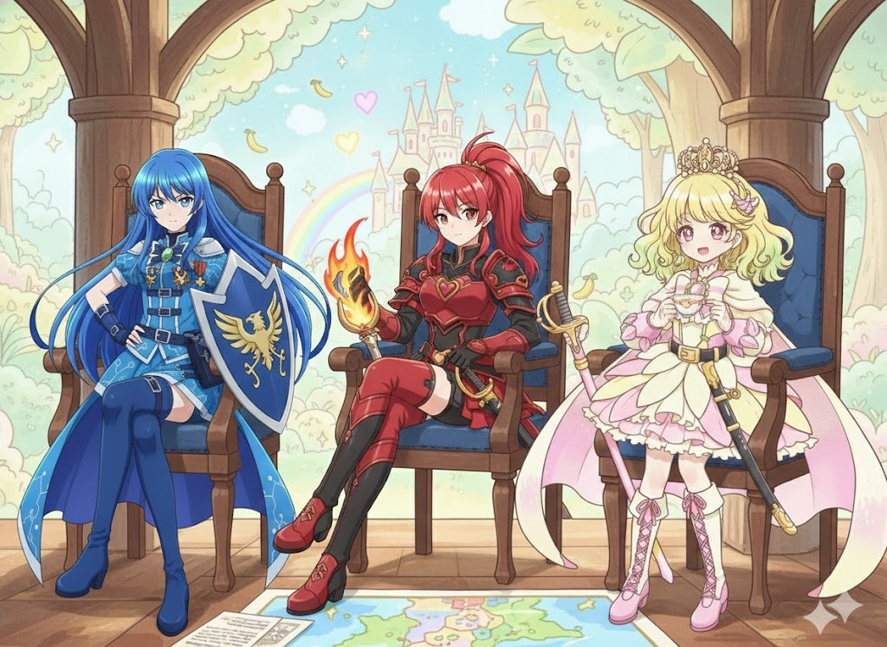

## 目次

- [第1話「王冠の少女、覚醒！」](#第1話王冠の少女覚醒)
- [第2話「光の結束！キュアルミエール」](#第2話光の結束キュアルミエール)
- [第3話「バラバラな私たち？初めての部活動！」](#第3話バラバラな私たち初めての部活動)
- [第4話「体育祭は大同盟!?」](#第4話体育祭は大同盟)
- [第5話「炎の戦士ユン！キュアドラゴン参戦」](#第5話炎の戦士ユンキュアドラゴン参戦)
- [第6話「孤立の影 アイソレート」](#第6話孤立の影-アイソレート)
- [第7話「大地の恵みとデータ」](#第7話大地の恵みとデータ)
- [第8話「SNSの罠！映り込みにご用心」](#第8話snsの罠映り込みにご用心)
- [第9話「扇動者プロパガンダ」](#第9話扇動者プロパガンダ)
- [第10話「訪問!同盟国アルヴェリア」](#第10話訪問同盟国アルヴェリア)
- [第11話「鋼鉄の女戦士レーテ現る」](#第11話鋼鉄の女戦士レーテ現る)
- [第12話「赤の魂!レーテとの激突」](#第12話赤の魂レーテとの激突)
- [第13話「嵐の海！沈黙の島（前編）」](#第13話嵐の海沈黙の島前編)
- [第14話「嵐の海！誕生、キュアレーテ！」](#第14話嵐の海誕生キュアレーテ)
- [第15話「多文化交流！激辛外交？」](#第15話多文化交流激辛外交)
- [第16話「和解の条約。そして、さらなる結束へ」](#第16話和解の条約そしてさらなる結束へ)
- [第17話「プロパガンダの罠。消えた真実」](#第17話プロパガンダの罠消えた真実)
- [第18話「信じる力」](#第18話信じる力)
- [第19話「非公式パッチにご用心!?」](#第19話非公式パッチにご用心)
- [第20話「封印された過去」](#第20話封印された過去)
- [第21話「ママとの約束。プリキュア引退の危機!?」](#第21話ママとの約束プリキュア引退の危機)
- [第22話「多妖精国家の危機」](#第22話多妖精国家の危機)
- [第23話「暗躍のプロパガンダ。偽りの平和」](#第23話暗躍のプロパガンダ偽りの平和)
- [第24話「再結束に必要なこととは？」](#第24話再結束に必要なこととは)
- [第25話「同盟遮断！最後の戦士」](#第25話同盟遮断最後の戦士)
- [第26話「パワーアップ！再同期（リ・シンクロ）」](#第26話パワーアップ再同期リシンクロ)
- [第27話「トリック・オア・身代金!? お菓子ランサムウェアの罠」](#第27話トリックオア身代金-お菓子ランサムウェアの罠)
- [第28話「中立国家の選択」](#第28話中立国家の選択)
- [第29話「妖精文化の衝突」](#第29話妖精文化の衝突)
- [第30話「諦めない。もう一度連合の提案を」](#第30話諦めないもう一度連合の提案を)
- [第31話「絶対安全ではない？AIナビに一体何が？」](#第31話絶対安全ではないaiナビに一体何が)
- [第32話「祭りの準備は波乱含み！多数決の罠」](#第32話祭りの準備は波乱含み多数決の罠)
- [第33話「分断のステージ。みんなのアライアンス！」](#第33話分断のステージみんなのアライアンス)
- [第34話「人間と妖精の衝突」](#第34話人間と妖精の衝突)
- [第35話「歴史の傷跡、友情の絆」](#第35話歴史の傷跡友情の絆)
- [第36話「決裂」](#第36話決裂)
- [第37話「それぞれの後悔」](#第37話それぞれの後悔)
- [第38話「自由の覚醒」](#第38話自由の覚醒)
- [第39話「完成!スカイクラウド」](#第39話完成スカイクラウド)
- [第40話「かつての友、これからの道（前編）」](#第40話かつての友これからの道前編)
- [第41話「かつての友、これからの道（後編）」](#第41話かつての友これからの道後編)
- [第42話「ドラゴンの故郷」](#第42話ドラゴンの故郷)
- [第43話「沈黙のロビイスト」](#第43話沈黙のロビイスト)
- [第44話「アライアンス誕生！立ち上がる妖精たち」](#第44話アライアンス誕生立ち上がる妖精たち)
- [第45話「王家の血、私の選択」](#第45話王家の血私の選択)
- [第46話「ダークアライアンス大集合。絶体絶命？」](#第46話ダークアライアンス大集合絶体絶命)
- [第47話「激闘アイソレート」](#第47話激闘アイソレート)
- [第48話「扇動の終焉」](#第48話扇動の終焉)
- [第49話「つながる力」](#第49話つながる力)
- [第50話「世界条約」](#第50話世界条約)

---

# 第1話「王冠の少女、覚醒！」

> 留学生アローズは転校初日、妖精世界から逃げてきた妖精と出会う。ディクテーターの魔の手が迫る中、家に代々伝わるアライアンスフォンが起動しキュアクラウンになり初めての戦闘。

# 第2話「光の結束！キュアルミエール」

> 街に現れたダークアライアンス軍を追うクラウン。光の意志を持つ少女が覚醒しキュアルミエール誕生。

# 第3話「バラバラな私たち？初めての部活動！」

> 妖精アリアから「人間界の知識を深めよ」と命じられたアロは、学校内での「居場所（部活動）」を探すことに。
> すでに生徒会長として多忙な白葉、そしてPC部の主（ぬし）として活動する律。
> 二人の活躍を目の当たりにし、自分だけが「何者でもない」と焦るアロ。
> 「みんなで一緒にやりたかった」と寂しがる彼女だったが、白葉から「同盟とは、個性が独立してこそ成り立つもの」と、それぞれの場所で輝くことの意義を諭される。
> 一方、アイソレートがPC部の機材を介して、学校内の特定グループだけが見れる「分断掲示板」を生成し、生徒たちの不信感を煽り始める……。

# 第4話「体育祭は大同盟!?」

> 学校回。体育祭で同盟の意味を学ぶ。会の最中敵の妨害が入る。

# 第5話「炎の戦士ユン！キュアドラゴン参戦」

> 妖精世界で戦っていた戦士ユンと合流。キュアドラゴンとして参戦。

# 第6話「孤立の影 アイソレート」

> 孤立の化身アイソレート登場。孤独の恐怖が描かれる。孤独を埋めるためのSNSへ誘導。
> **（演出ノート：アイソレートの変身。無数の液晶画面に囲まれ、自己の内側へ沈み込んでいくような冷たい演出。最後に歪んだ空中ゲートから日本刀を引き抜き、鏡を一閃する）**

# 第7話「大地の恵みとデータ」

> 農業国家ライクランドを舞台に、気象データや食料リテラシーを扱う。

# 第8話「SNSの罠！映り込みにご用心」

> アロがSNSに上げた何気ない写真の「映り込み」から、アイソレートが居場所を特定。実生活に影が忍び寄る恐怖。便利さと裏腹にある「プライバシー保護」の基本を学ぶ。

# 第9話「扇動者プロパガンダ」

> プロパガンダ初登場。SNSや噂を操り街に不信を広げる。一度広がった情報は元に戻せない恐ろしさを知る。
> **（演出ノート：プロパガンダの変身。ホログラムの偽ニュース群を爆破し、派手なネオンを纏って登場。プリキュアをパフォーマンスで圧倒する）**

# 第10話「訪問!同盟国アルヴェリア」

> 第一王女ラベンダー（ラヴィ）から平和条約を結んだ国と同盟し、アライアンスを結成することを提案される。のちの脱退の伏線を残す。

次の話の伏線
占領された妖精国の瓦礫の上で、アイソレートと戦士レーテが少し戦う。{ハサン湖の戦いが元ネタ}プロパガンダが止めに入り、不可侵条約を結んだ。
プロパガンダとレーテが慇懃無礼に会釈を交わす（有名な独ソ不可侵条約の風刺画のパロディ演出）。
プロパガンダ「労働者の冷徹な暗殺者とお見受けいたしますが？」
レーテ「そういう君はかつてオーシャン王国から国家予算の半分を奪った世界一の詐欺師ではないか？」
形だけの「不可侵条約」を結んだ二人が、プリキュアという共通の敵を前に、一時の不気味な連帯を見せる。

# 第11話「鋼鉄の女戦士レーテ現る」

> 圧倒的戦力の敵戦士レーテ登場。敗北の危機。
> **（演出ノート：レーテの変身。ディクテーターとは別系統の、重厚な歯車の回転と蒸気が噴き出す工業的な演出。軍用デバイスらしい質実剛健なカッコよさを描写）**

# 第12話「赤の魂!レーテとの激突」

> レーテとの決戦。プリキュアを圧倒するレーテだったが、その背後から突如として味方であるはずのプロパガンダによる無慈悲な背後の一突きを受ける。
> 「役に立たない同盟は、切り捨てられるのみ」――分断と孤立の非情さを身をもって知った彼女をプリキュアが救い出し、共闘への道が拓かれる。

# 第13話「嵐の海！沈黙の島（前編）」

> 季節は夏休み前。レーテことイリーナが、人間界に馴染むため「留学生」としてアロたちの学校へ編入。
> 白葉の采配により、彼女の生真面目な性格を活かして生徒会「書記」に任命される。
> 初めての「平和な日常」に戸惑うイリーナ。そんな中、夏の海に不穏な影が……。
> 合宿で訪れた島で強力なジャミングが発生。通信不能の中、アナログな手段で敵を索敵する。

# 第14話「嵐の海！誕生、キュアレーテ！」

> 通信不能の中、敵に追い詰められるプリキュア。しかし、イリーナが仲間を信じる心で旧式の物理デバイスを再起動させる。
> 「役に立たない同盟などない。私が、それを証明する！」
> 自らの意志で「キュアレーテ」と名乗り、アライアンス（同盟）への参加を決意。

# 第15話「多文化交流！激辛外交？」

> 各国の料理を持ち寄る文化祭。味覚の「違い」を受け入れることが多文化共生の第一歩。

# 第16話「和解の条約。そして、さらなる結束へ」

> レーテの正式加入を祝うセレモニー。人間界と妖精界の間で、アライアンスの正式なメンバーとしての和平条約が交わされる。
> その不変の意志に世界が呼応し、アライアンスのネットワークがさらに強固なものとなる。

# 第17話「プロパガンダの罠。消えた真実」

> プロパガンダがプリキュアの「偽の悪事動画」を拡散。街中から冷たい視線を浴びる4人。
> 白葉の演説と、ハートピア連邦の証言によって情報の真偽を証明し、国際的な協力体制を築く。

# 第18話「信じる力」

> 偽情報に翻弄される街。リテラシーの大切さを学ぶ。律が技術的なサポートで間接的に活躍。

# 第19話「非公式パッチにご用心!?」

> 律が勝手に改良した拡張機能のバグで思わぬ大ピンチ。技術の「正しい運用」を学ぶ。

# 第20話「封印された過去」

> ヨーカスター家が代々守ってきた「均衡」の歴史。重い責任の一端を知るアロ。

# 第21話「ママとの約束。プリキュア引退の危機!?」

> テストの成績が悪くスマホ没収の危機！実生活とのバランスを学ぶ日常回。

# 第22話「多妖精国家の危機」

> レーテの故郷ユニオン連邦がダークアライアンスの総攻撃を受け、通信網が寸断。
> バラバラに分断された妖精たちが互いに孤立し、疑心暗鬼に陥る中、アライアンスの真価が問われる。

# 第23話「暗躍のプロパガンダ。偽りの平和」

> プロパガンダが「情報独裁者」としての本性を現し始める。多妖精国家をバラバラに引き裂く言葉の刃。
> また、この回で謎の協力者**ファスケス**が初めてプリキュアの前に現れ、窮地を救う（潜入の始まり）。
> **（演出ノート：最終ボス・プロパガンダの変身。圧倒的な情報量と赤ノイズを伴う特撮スタイルの変身。威圧感を見せる）**

# 第24話「再結束に必要なこととは？」

> ダークアライアンスの包囲網により、ユニオン連邦の各区画が孤立。
> 恐怖に負けず、再び手を取り合うために必要な「勇気ある信頼」を描く。

# 第25話「同盟遮断！最後の戦士」

> 新式アプリが全滅。旧式のレーテのみが孤軍奮闘する中、システムを復旧させる。

# 第26話「パワーアップ！再同期（リ・シンクロ）」

> バージョンアップで新たな力を得るが、AIへの依存度が高まることへの警鐘。

# 第27話「トリック・オア・身代金!? お菓子ランサムウェアの罠」

> ハロウィン回。他人の「ちょっと恥ずかしい秘密」を人質に取る妖精。情報の拡散性を学ぶ。

# 第28話「中立国家の選択」

> アルヴェリア王国がアライアンスを離脱。「同盟より国民」というリアリズムとの衝突。

# 第29話「妖精文化の衝突」

> 言語や習慣の違いによるトラブル。通訳（AI）の限界と、直接対話の重要性。

# 第30話「諦めない。もう一度連合の提案を」

> 離脱した国々にもう一度協力を仰ぐアロ。粘り強い外交回。

# 第31話「絶対安全ではない？AIナビに一体何が？」

> AIナビがハルシネーションを起こし、誤情報を発信。ヤンと白葉の軋轢。
> しかし、データにはない「小さなアナログの約束」を根拠にプリキュアがAIの誤りを見抜く。不完全な自分を認めてもらったアリアは、信頼による真の再同期を果たす。
> **（歴史パロディ：西安事件）** アリアは「今は内輪揉めをしている場合ではない」と演算し、独断でクラウンを拘束。無理やりユンとイリーナを会談の場（円卓）に引きずり出すという強硬手段に出る。これが「第二次アライズ連合（国共合作）」の遠い引き金となる。

# 第32話「祭りの準備は波乱含み！多数決の罠」

> 文化祭のクラス出し物を決める会議。白葉の司会のもと「カフェ」に決定するが、こだわりの強い「展示」を希望していた少数派の生徒たちが不満を募らせる。
> 白葉は「民主主義のルール」として納得させようとするが、理屈では割り切れない感情の隙間をアイソレートが突く。
> 一方、アロは料理研究部で「世界のお茶試食会」、ユンは空手部で「瓦割り合戦」の準備に奔走。律はPC部で「VR展示」の機材を調整中。

# 第33話「分断のステージ。みんなのアライアンス！」

> 文化祭当日。アイソレートによって「少数派だけのSNSコミュニティ（エコーチェンバー）」に閉じ込められた生徒たちが、自分たちの展示を強行し、クラスのカフェをボイコット。
> 会場は大混乱に陥るが、イリーナが「書記」として作成していた予備のスケジュール案と、PC部・律のハッキング対策でコミュニティを解放。
> 「少数派を切り捨てるのではなく、多文化として共存させる」ことの大切さを学び、即興の「コラボカフェ＆展示」へとアライアンスを結成して敵を撃退する。

# 第34話「人間と妖精の衝突」

> 敵組織ディクテーターが放った「優先保護対象演算（プライオリティ・ロジック）」の影響により、街の重要施設と、妖精たちの居住区のどちらを優先して守るかという選択を迫られる。
> 効率と戦略を重視するシステマチックな妖精側の意見と、一人一人の命と街の歴史を守ろうとする人間側の意見が真っ向から対立。
> プリキュアたちの間でも「大を救うために小を切り捨てる」論理への疑問が生まれ、これまで一枚岩だった信頼関係に、計算では割り切れない亀裂が生じ始める。

# 第35話「歴史の傷跡、友情の絆」

> ドラゴン王国（ユンの故郷）の間で、かつて起きた「国境データ紛争」の真実が明らかになる。
> プロパガンダが過去のアーカイブを改ざんし、赤龍派と青龍派の不信感を煽ることで、内部分裂を引き起こす。
> 「今の友情」か「民族の歴史」か――重すぎる過去を背景に、ユンは戦いの中でどちらにも背中を預けることができなくなってしまう。

# 第36話「決裂」

ドラゴン王国の内部分裂はプリキュアにも及んだ。レーテとユンは赤龍派の支援を、他のメンバーは青龍派の支援をそれぞれ受けることになり、戦いをすることに。その様子を見ていた**ファスケス**が「結束」という名の同調圧力をかけ、チームの亀裂を決定的なものにする。プロパガンダは漁夫の利を得て、ルミエールをさらう。その様子を見ていたスンスン妖精は何とも悲しそうな顔をしていた。

# 第37話「それぞれの後悔」

> バラバラになった4人。自分たちのエゴと向き合う潜伏期間。アロは自分の過ちを認め、ユンは自分の気持ちを整理し、レーテは自分の考えを改め、律は自分の弱さを認める。ドラゴン王国の内戦はまだ続く。一方、プロパガンダはルミエールを洗脳し、街の主要OSを掌握し、プリキュアをテロリストとして認定することを画策する。

# 第38話「自由の覚醒」

> 残された3人が絶望に沈む中、PC部の律（リバティ）が独自のプログラミングで「分断されない通信プロトコル」を自作。
> 組織のルールや他人の評価に縛られない彼女の「自由（リバティ）」な精神が、閉ざされた仲間たちの通信を強制的に再接続する。
> 「繋がってないなら、私が新しいインターネットを引くだけ！」
> キュアリバティが真の覚醒。全方位ハッキングを打ち破り、反撃の狼煙を上げる。

# 第39話「完成!スカイクラウド」

> リバティの自由な発想と、イリーナの旧式のアナログ技術、アロの王家が守ってきた秘密の回線が融合。
> 特定の国やサーバーに依存しない、分散型ネットワーク「Sky Cloud」を構築。
> 平和のデータを空（大気中）に分散して保存することで、ハッキング不可能な新基盤を確立する。

# 第40話「かつての友、これからの道（前編）」

> 洗脳されたルミエールが、街の主要OSを掌握し、プリキュアをテロリストとして認定。
> 窮地に立たされたクラウン（英）、リバティ（米）、レーテ（蘇）の3人は、状況を打開するため歴史的な「作戦会議」を開催{「ヤルタ会談」のパロディ}。
> 「ルミエール（フランス）の救出後の統治（責任）をどうするか？」
> 円卓で高級紅茶（アロ）、コーラ（律）、ボルシチ（イリーナ）を囲み、脳筋政治家さながらの権謀術数を繰り広げながら、ルミエール奪還のための「オーバーロード作戦」を策定する。
> 

# 第41話「かつての友、これからの道（後編）」

> 「オーバーロード作戦」決行。リバティの波状攻撃とレーテの重装甲が道を切り拓き、クラウンがルミエールの「心の認証」を突破。
> 救えなかった過去を、今の仲間と共に乗り越え、ついにルミエールを奪還。
> 改めて5人の「アライズ・アライアンス」が再結成される。

# 第42話「やり残したこと」

> 保守派と革新派の分離状態にあったドラゴン王国ではあるが、キュアドラゴンの働きかけにより停戦、ともにアライアンスに加盟し防衛戦を展開。伝統的な「狼煙」や「手旗信号」といった電波に依存しない通信が、敵の電子ジャミングを無効化する。
> 伝統と革新の融合こそが、最強のバックアップになることをユンが証明する。

# 第43話「沈黙のロビイスト」

> 影で糸を引く**ファスケス**が、各国の会議に「ロビイスト」として工作員を送り込み、強制的な結束（ファシズム）を各国に強要し、本来のアライアンスを内部崩壊させようとする。
> プリキュア禁令に対し、第一王女ラベンダー（ラヴィ）が代表団の前に立ち、アロたちのこれまでの勇気と貢献を政治の場で訴える。
> 「私たちはデータではなく、彼女たちの『誠実さ』と条約を結んだのです！」
> ラヴィの外交的勝利により、プリキュアが「国際的パートナー」として正式に公認される。

# 第44話「アライアンス誕生！立ち上がる妖精たち」

> プリキュア抜きでも、妖精たちが自発的に連合（アライアンス）を結成。
> プロパガンダの放つ「プリキュア不要論」という偽情報に対抗するため、街中に「アライアンス勧誘ポスター」を掲示。
> 各国の歴史的なポスターをパロディしたイメージ戦略により、不安に揺れていた妖精たちの心を「視覚的」に繋ぎ止める。

| キャラクター         | 元ネタ（徴兵ポスター）   | パロディポスター                            |
| -------------------- | ------------------------ | ------------------------------------------- |
| **蒼井 律**    | アメリカ：I Want YOU     | **君が必要だ！**           |
| **アローズ** | イギリス：Kitchener      | **アライアンスは君を待っている！**              |
| **イリーナ**   | ソ連：Did you volunteer? | **君はアライアンスに志願したか？**    |
| **天羽 白葉**  | フランス：On les aura!   | **自由のために！(Pour la Liberté!)** |
| **ユン**       | 中国：保衛祖国           | **平和を保衛せよ！**                  |

# 第45話「王家の血、私の選択」

> アロの母国から「外交特権の剥奪と帰国命令」が下る。
> しかしアロは、「私は王冠のために生きるのではない。世界を繋ぐために起ち上がったのだ」と宣言。
> 伝説的な演説「私たちは決して降伏しない（We shall never surrender）」を放ち、一人の少女として戦い続ける道を選ぶ。

# 第46話「ダークアライアンス大集合。絶体絶命？」

> プロパガンダが扇動した「孤立主義国家連合」による総攻撃が開始。
> 街のシステムは停止。しかし、市民たちは「Sky Cloud」を通じて互いの安否を確認し、パニックを抑え込む。

# 第47話「激闘アイソレート」

> アイソレートとの最終決戦。
> 彼女は「隣人など不要、自分だけが正しい世界」を具現化しようとするが、アロは「物理的な隣人」がいる温もりを説く。
> アイソレートの振るう「日本刀（漆黒の打刀・絶縁）」に対し、アロは王冠の絆でその刃を砕く。
> 「孤独を埋めるのは情報の拡散じゃない。隣に誰かがいるという『事実』だ！」

# 第48話「扇動の終焉」

> プロパガンダとの最終決戦。
> 彼女が空に映し出した「世界の終わり」というディープフェイクを、5人の「真実の同期（フルシンクロ）」が物理的に塗り替えていく。
> 派手な演出には「変わらぬ誠実さ」で対抗。フェイクニュースに疲れた人々の心に、一滴の真実が染み渡る。

# 第49話「つながる力」

> 最終ボス・プロパガンダによる「全銀河・全次元の同時支配ゲート」が展開。
> しかし、これまで結んできた「和平条約」がSky Cloud上で一つの巨大なプロトコルを形成する。
> 全妖精、全人類が「アライズ・インターナショナル」を合唱。
> 分断の壁を、世界中の人々の「いいね（承認）」が突破し、プロパガンダを浄化する。

# 第50話「世界条約」

> 最終回。アライアンス（同盟）は解散せず、共に未来を作る「世界条約」へと発展。
> アロたちは普通の学生生活に戻るが、そのスマホには「世界中の友人」からの通知が今日も届き続ける。
> 境界を越えた友情は、永遠にログインし続ける――。
