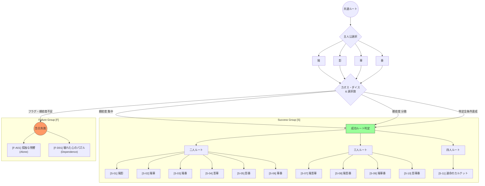

# ルート分岐詳細案：四重奏のデスティニー

企画書に基づき、全13ルートの構造を「成功(S)」と「失敗(F)」の記号体系で整理します。

## ルートマップ（区分け分木図）

---

## 1. 成功ルート：二人関係 [S-01] 〜 [S-06]

| ID | ペア | サブタイトル | ストーリー概要 |
| :--- | :--- | :--- | :--- |
| **[S-01]** | 陽 × 影 | 静寂に灯る光 | 図書室の隅にいた影を陽が救い出す、王道の救済百合ストーリー。 |
| **[S-02]** | 陽 × 華 | 高嶺の花と太陽 | 生徒会長の重圧を陽が溶かす、等身大の恋物語。 |
| **[S-03]** | 陽 × 奏 | リズムとメロディ | 正反対の二人が音楽を通じて心拍数を重ねる情熱的な関係。 |
| **[S-04]** | 影 × 華 | 秘密の図書室 | 放課後の密室で育まれる、二人だけの静かな信頼。 |
| **[S-05]** | 影 × 奏 | 不協和音の共鳴 | 旋律と歌詞が溶け合う、繊細でアーティスティックな絆。 |
| **[S-06]** | 華 × 奏 | 秩序と自由 | 衝突の果てに互いを唯一無二と認める、ライバル関係の昇華。 |

## 2. 成功ルート：三人・四人関係 [S-07] 〜 [S-11]

- **[S-07] 陽・影・華 (「トライアングル・ピース」)**: 三人の絶妙な均衡と温かい絆。
- **[S-08] 陽・影・奏 (「夕暮れのセッション」)**: 音楽を軸にした爽やかな青春。
- **[S-09] 陽・華・奏 (「スクール・アイドル・プロジェクト」)**: 学園全体を巻き込む大騒動と連帯。
- **[S-10] 影・華・奏 (「月の裏側の三奏」)**: 夜の校舎で秘密を共有する夜想曲的関係。
- **[S-11] 四重奏のデスティニー (「運命のカルテット」)**: 全員が対等なパートナーとなる最高のハッピーエンド。

## 3. 失敗ルート [F]

告白に失敗し、「すでに相手がいる」と拒絶された後の展開です。

#### [F-A01] 孤独な残響 (Alone)

- **内容**: 誰とも結ばれず、失恋の傷を抱えたまま一人で卒業を迎える。
- **後味**: 寂しさと後悔が残るビターエンド。

#### [F-D01] 壊れた心のパズル (Dependence)

- **内容**: 絶望し、自殺未遂などの極端な行動に走りそうになった際、別のヒロインに救われる。
- **後味**: 救い出された温かさに依存し、歪ながらも深い執着で結ばれる昏い愛。
