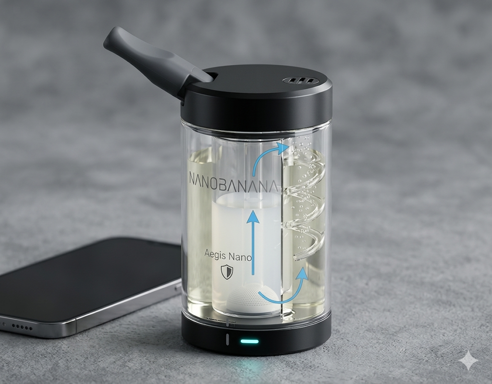

## 最終製品仕様：Bubble-Pure "Nano" (バブルピュア・ナノ)

作成日:2026/4/26

### 1. 内部構造設計：同心円サイクロン方式

高さを10cmに抑えるため、垂直方向ではなく「水平・螺旋方向」の移動距離を稼ぐ構造を採用します。

* **同心円デュアルタンク:** 容器を内筒と外筒に分けます。内側には「アルカリ＋界面活性剤」、外側には「酸性液」を充填。
* **スパイラル・バブリング・パス:** 内筒の底から出た泡が、らせん状のガイドに沿って回転しながら上昇します。これにより、直線距離10cmに対し、実質的な接触距離を30cm以上に延長し、小型でも高い浄化率を維持します。
* **ハニカム・ミストフィルター:** 上部の排気口直下にハニカム状の吸着材を配置。浄化後の空気に含まれる微細な水滴（ミスト）を完全にカットし、周囲を湿らせません。

---

### 2. プロダクト・ビジュアル

* **フォルム:** 直径約5.5cm、高さ10.5cm。エナジードリンクのミニ缶より一回り小さい程度のサイズ感。
* **シェル素材:** 航空機グレードのアルミニウム（外装）× 高透明ポリカーボネート（内装）。
* **キャップ構造:** マウスピース（吸い口）はスライド式、または180度回転して本体に収納されるギミック。ポケットに入れても衛生を保てます。
* **カラー展開:** スペースグレー、マットブラック、サテンシルバーなど、高級ガジェット風の質感を想定。

---

### 3. ユーザー体験（UX）

1. **展開:** キャップをスライドさせるとマウスピースが出現。
2. **パージ（吐き出し）:** 喫煙後、このデバイスに息を吐き出す。内側のLEDが淡く光り、バブリング（浄化中）であることを知らせます。
3. **クリーン排気:** 本体上部のスリットから、無臭・無害化された空気が静かに排出されます。
4. **リセット:** 1日の終わりに中の液体を捨て、水洗いするだけでメンテナンス完了。

---

### 4. 商品企画まとめ（プレゼン資料構成）

| **項目**           | **詳細**                                                                     |
| ------------------------ | ---------------------------------------------------------------------------------- |
| **製品名**         | **Bubble-Pure "Nano"**                                                       |
| **キャッチコピー** | 「その一息を、次世代のクリーンへ。」                                               |
| **主要ターゲット** | 都市部の喫煙者、非喫煙者と同居するエンジニア、カフェ等のテラス席利用者。           |
| **解決する課題**   | 呼気による二次喫煙被害、室内・衣類への臭い移り、喫煙者の肩身の狭さ。               |
| **技術的優位性**   | 湿式スクラバーを個人用にダウンサイジング。2段階化学反応による99%の消臭（理論値）。 |

