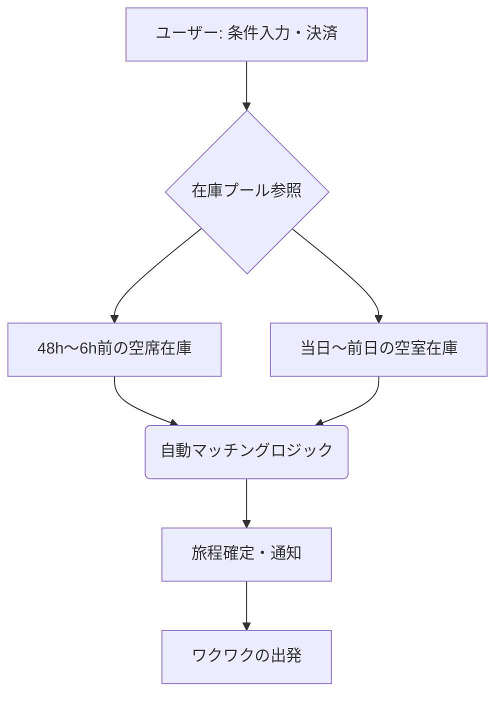

# ランダムトラベルパッケージ企画書（仮称）

**作成日**: 2025/12/25

> [!IMPORTANT]
> **コンセプト:「予算だけ決めて、行き先も宿も航空便もすべておまかせ」**
> 出発直前に発生する「航空機の空席」と「地方ホテルの空室」をリアルタイムでマッチングし、圧倒的な低価格で提供する募集型企画旅行（ランダム型ダイナミックパッケージ）です。

---

## 1. 背景・課題

### 航空・宿泊業界の「失われる価値」

- **航空会社**: 離陸後の空席は収益化不可能な「負債」となる。地方路線や平日の搭乗率維持が課題。
- **地方ホテル**: 平日や閑散期の空室。過度な値下げはブランド価値を毀損し、OTAへの依存度も高い。

### 利用者の潜在ニーズ

- 「安く旅行したい」という基本欲求に加え、行き先を決められない「選択の疲れ」の解消。
- デジタル時代における「偶然性」や「サプライズ感」への価値提示。

---

## 2. ターゲットペルソナ

| ターゲット層               | 特徴・ニーズ                                       | 利用シーン                       |
| :------------------------- | :------------------------------------------------- | :------------------------------- |
| **柔軟な大学生**     | 予算は限られているが時間はあり、どこでも楽しめる。 | 講義の合間や休暇中の低予算旅行。 |
| **ソロ旅行者**       | 行き先にこだわりがなく、日常から離れたい。         | 週末の突発的なリフレッシュ。     |
| **アクティブシニア** | コスパを重視しつつ、新しい場所との出会いを求める。 | 平日の空いた時間を活用した旅行。 |

---

## 3. サービス内容

### 商品構成

- **区分**: 募集型企画旅行（航空券＋宿泊）
- **設定可能項目**: 出発空港、出発日、時間帯（午前/午後など）、予算上限、宿泊日数（0〜3泊）
- **おまかせ項目**: 行き先、利用航空会社・便名、ホテル名・部屋タイプ

### 在庫マッチング・フロー（図解）

---

## 4. 価格設計とメリット

- **価格帯**: 通常の個別予約価格の **40〜60%**
- **決済**: 一括前払い・原則返金不可（直前在庫のため）

### 競合比較

| 項目                 | 本サービス             | 航空会社「どこかにマイル」等 | 一般的なLCCセール |
| :------------------- | :--------------------- | :--------------------------- | :---------------- |
| **セット内容** | 航空 ＋ 宿泊           | 航空のみ                     | 航空のみ          |
| **直前予約**   | 非常に強い（当日可）   | 不可（数日前まで）           | 枠に限りあり      |
| **サプライズ** | 宿も含めたトータル体験 | 行き先のみ                   | なし              |

---

## 5. 往復利用ルール（帰路拘束）と安全装置

> [!TIP]
> 帰路の座席確保は、本サービスの信頼性の根幹です。

1. **帰路便の優先確保**: 往路の在庫確定時点で、帰路便の「空席バッファ」がある路線のみをマッチング対象とします。
2. **代替手段の担保**: 帰路便が欠航等の場合、代替地への自動割当や提携他社便への振替保険を適用。
3. **特典付与**: 帰路搭乗完了で「旅の完走ボーナス」として次回割引ポイントを付与し、ノーショーを抑制。

---

## 6. 往復利用ルール（帰路拘束）

### 基本構造

- 本商品は **往復航空券込みパッケージ**
- 往復とも当社指定便を利用

### 仕組み

- 帰路航空費は事前に商品価格へ含めて徴収
- 帰路未搭乗でも返金なし
- 帰路搭乗完了で特典付与（例：次回割引）

※ 強制ではなく、旅行商品条件として設定

---

## 7. 利用フロー

1. Web / アプリで条件入力・決済
2. 出発前日〜数時間前に旅程通知
3. 出発・現地滞在
4. 指定された帰路便で帰着
5. 旅行完了

---

## 6. 事業者・地域のメリット

- **航空会社**: 空席のステルス収益化（値下げの可視化を回避しつつキャッシュフロー改善）。
- **地方ホテル**: ブランドを維持したまま空室を消化。新規の顧客接点を創出。
- **自治体**: 平日送客による観光消費の平準化。特定の観光地への集中（オーバーツーリズム）を回避。

---

## 7. 将来展望とKPI

- **フェーズ1**: 国内主要LCCと地方都市旅館の連携開始。
- **フェーズ2**: テーマ別（温泉、グルメ、秘境）のランダム選択機能追加。
- **フェーズ3**: アジア圏を中心とした国際線への展開。

### 主要成功指標 (KPI)

- 提携路線の平均搭乗率 **+10%** 向上
- 提携ホテルの平日稼働率 **+15%** 向上
- ユーザーのリピート率（再ランダム率） **30%**

---

## 8. 法制度整理

- 旅行業法上の募集型企画旅行
- 第2種または第3種旅行業登録
- 旅行業約款整備
- 弁済業務保証金対応

---

## 9. まとめ

本企画は、単なる安売り旅行ではありません。
**「失われるはずの在庫」を「予期せぬ喜び」へと変換し、移動と宿泊の余剰を地域の活力へと繋ぐ、持続可能な観光インフラです。**
